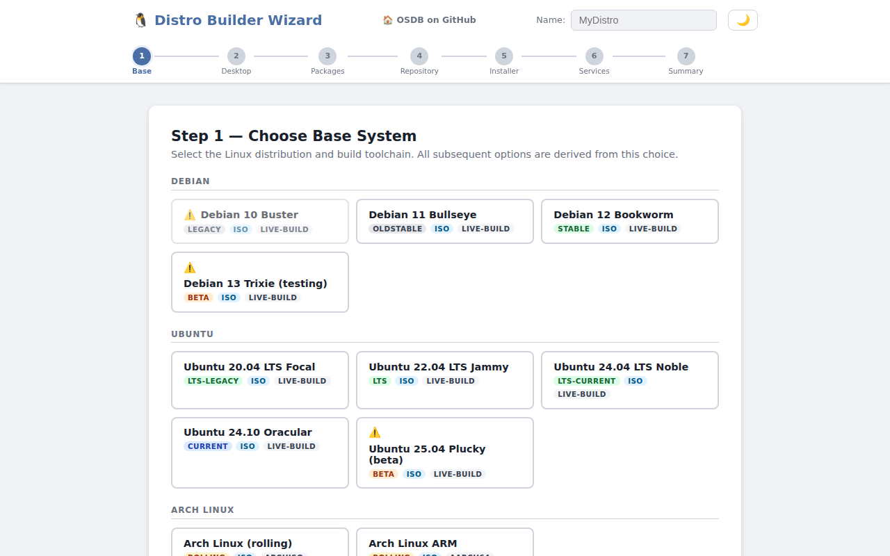
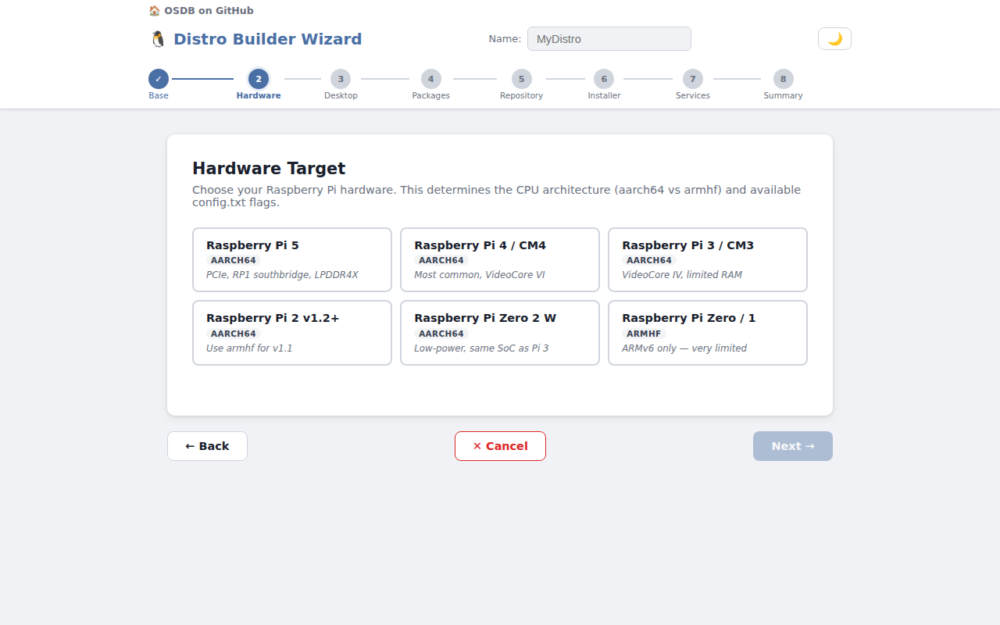
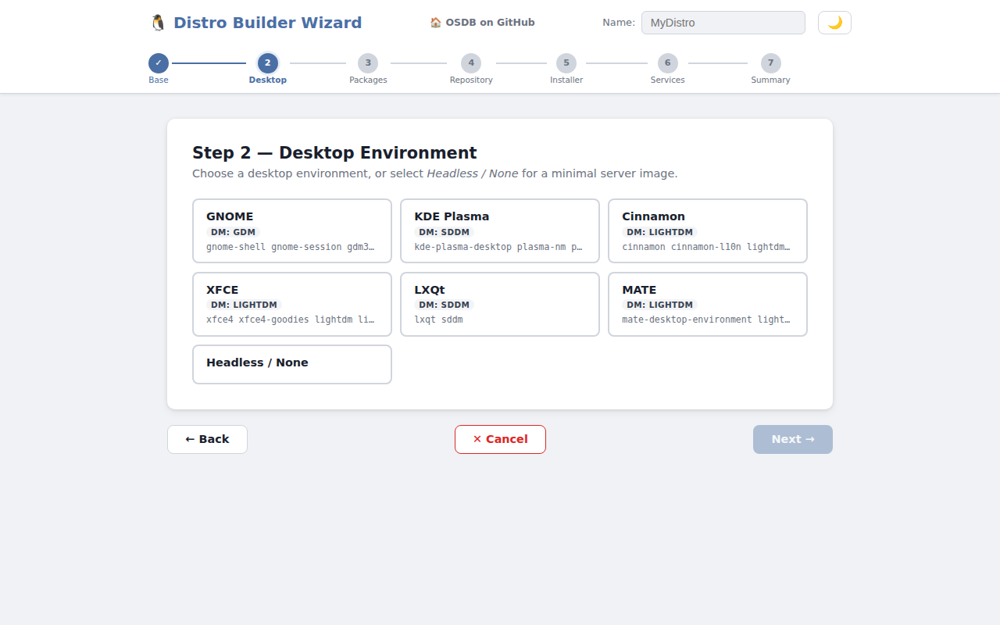
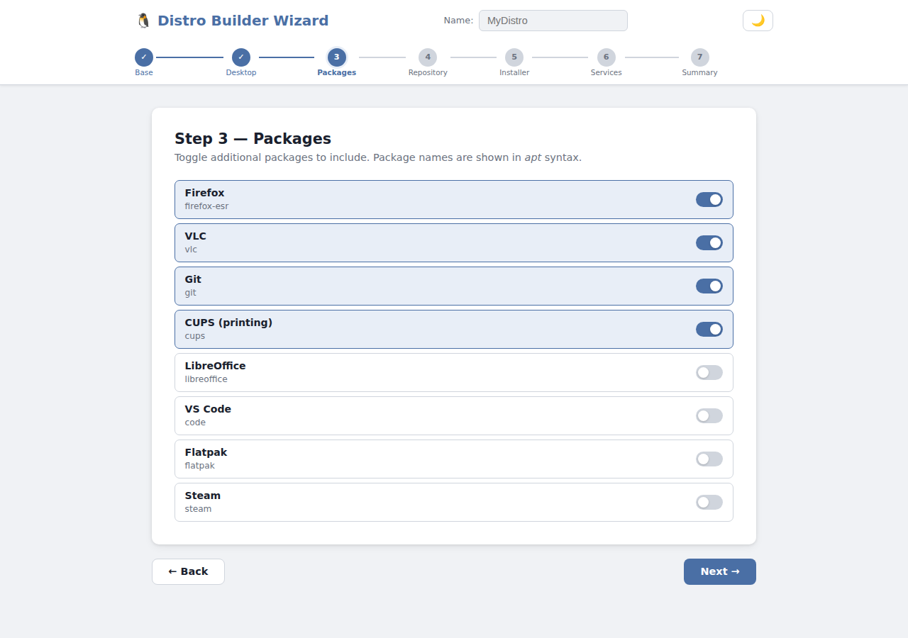
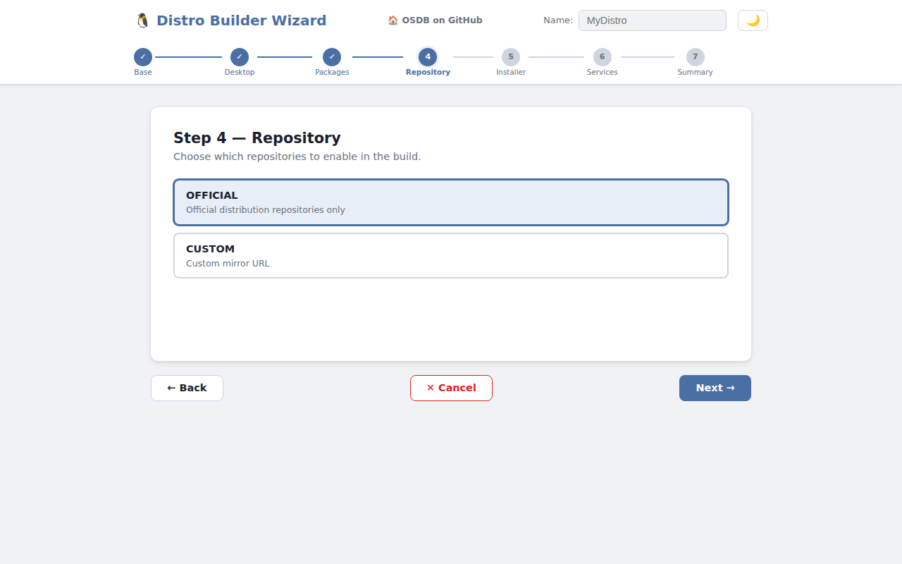
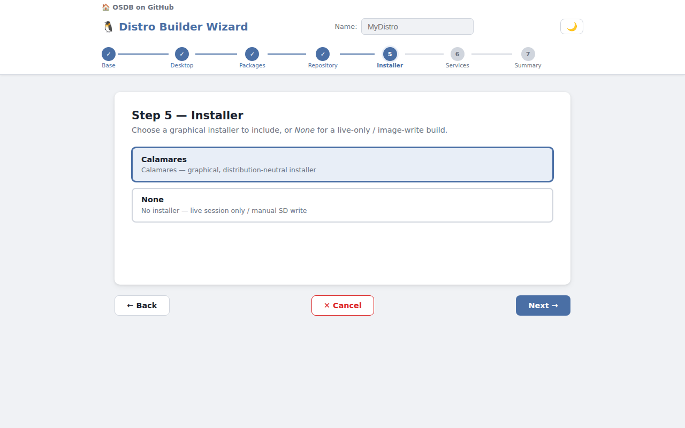
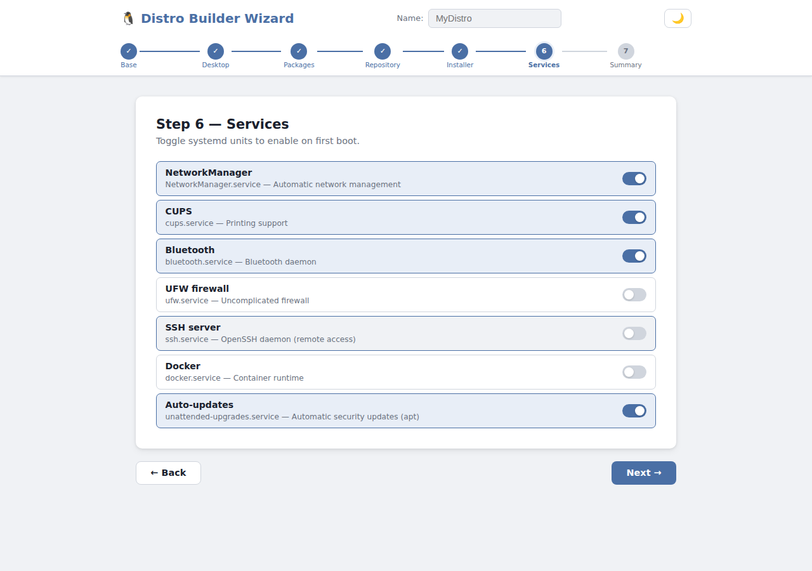
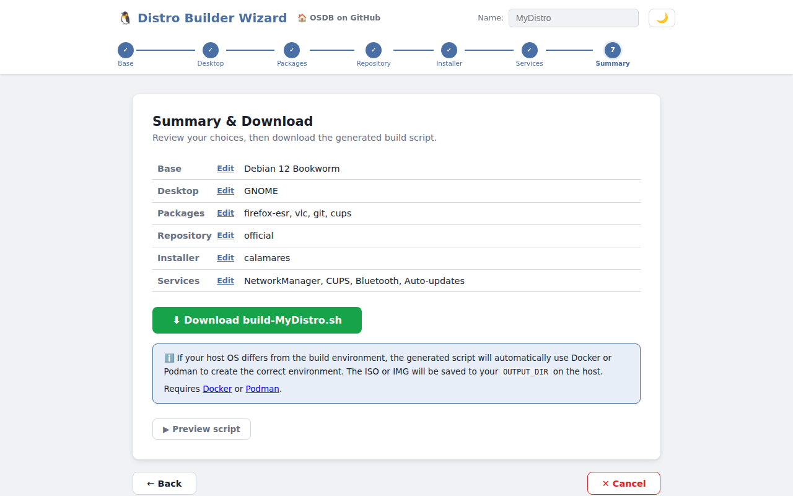

# OSDB — Linux OS Distro Builder Wizard

**🔗 Live wizard:** https://fugginold.github.io/OSDB/

A self-contained, static WebUI that walks you through building a custom Linux distribution and outputs a ready-to-run `build-distro.sh` bash script — no backend required.

---

## How it works

1. Open the wizard in your browser
2. Choose your **base distribution** (Debian, Ubuntu, Arch, Fedora, Raspberry Pi, openSUSE)
3. Select a **desktop environment** (GNOME, KDE, XFCE, headless, …)
4. Toggle **packages** and **services**
5. Pick a **repository type** and **installer**
6. Review the **summary**, download your customised build script, and copy the **one-liner run command**

The generated script is a complete, commented bash script ready to run on a matching host system.
The **⚡ One-liner run command** on the summary page encodes the script as base64, so you can
paste a single command into any terminal to download, `chmod +x`, and execute it in one step — no
separate download needed.

---

## Supported bases

| Distribution | Track | Builder | Output |
|---|---|---|---|
| Debian 10 Buster | legacy (EOL) | live-build | ISO |
| Debian 11 Bullseye | oldstable | live-build | ISO |
| Debian 12 Bookworm | stable | live-build | ISO |
| Debian 13 Trixie | beta | live-build | ISO |
| Ubuntu 20.04 LTS Focal | lts-legacy | live-build | ISO |
| Ubuntu 22.04 LTS Jammy | lts | live-build | ISO |
| Ubuntu 24.04 LTS Noble | lts-current | live-build | ISO |
| Ubuntu 24.10 Oracular | current | live-build | ISO |
| Ubuntu 25.04 Plucky | beta | live-build | ISO |
| Arch Linux (rolling) | rolling | archiso | ISO |
| Arch Linux ARM | rolling | archiso | ISO |
| Fedora 39–42 | legacy/stable/current/beta | lorax | ISO |
| Raspberry Pi OS Lite (Bookworm) | stable | pi-gen | IMG |
| Raspberry Pi OS Desktop (Bookworm) | stable | pi-gen | IMG |
| Raspberry Pi OS Full (Bookworm) | stable | pi-gen | IMG |
| Ubuntu 22.04 LTS for RPi | lts | ubuntu-rpi | IMG |
| Ubuntu 24.04 LTS for RPi | lts-current | ubuntu-rpi | IMG |
| Arch Linux ARM — Pi 4 | rolling | alarm-rpi | IMG |
| Arch Linux ARM — Pi 5 | rolling | alarm-rpi | IMG |
| openSUSE Leap 15.6 | stable | kiwi | ISO |
| openSUSE Tumbleweed | rolling | kiwi | ISO |

---

## Repository layout

```
docs/               ← GitHub Pages root (static site)
  index.html        ← Single-page wizard shell
  wizard.js         ← All wizard logic + script generators
  styles.css        ← Styling (badges, cards, progress bar)
scripts/
  examples/         ← Static reference scripts (ShellCheck CI)
  tests/            ← Stable-base generator matrix tests
.github/
  workflows/
    pages.yml       ← Deploy docs/ to GitHub Pages on push
    shellcheck.yml  ← Lint example scripts with ShellCheck
```

## Test matrix

Generate and run stable-base default matrix tests:

```bash
node scripts/tests/generate-stable-base-tests.cjs
bash scripts/tests/run-stable-default-matrix.sh
```

The matrix validates, for each stable non-EOL base and each supported DE, that generated scripts include all default packages and default services. The runner prints only failures.

## Screenshots

| Step | Screenshot |
|---|---|
| **Step 1 — Choose Base System** |  |
| **Hardware Target** *(Raspberry Pi only)* |  |
| **Step 2 — Desktop Environment** |  |
| **Step 3 — Packages** |  |
| **Step 4 — Repository** |  |
| **Step 5 — Installer** |  |
| **Step 6 — Services** |  |
| **Step 7 — Summary** |  |

---

## Running locally

No build step needed — just open `docs/index.html` in a browser:

```bash
cd docs
python3 -m http.server 8080
# then open http://localhost:8080
```

## CI

- **ShellCheck** — lints all scripts in `scripts/examples/` on every push/PR
- **Stable Base Matrix** — regenerates and runs `scripts/tests` checks for all stable non-EOL bases/DEs, failing on any mismatch
- **GitHub Pages** — deploys `docs/` to `https://fugginold.github.io/OSDB/` on every push to `main`

## License

[LICENSE](LICENSE)
